# Visualisation Showcase for climate indicators

Climate indicators are useful aggregations of meteorological data on long timescales (climatological scale) to inform about climate change. Below is a brief showcase of the visualisation routines available within this repository. As example, the average air temperature (`TGmean`) is used to showcase the different plots.

### Time series of spatial averages

Time series of spatial averages across the whole (SPARTACUS) domain can be seen below. Depending on the indicator, these are available either as annual timeseries plot, or containing 4 subplots for each season, whenever an indicator can be aggregated to season.

The time series plots show the annual/seasonal spatially averaged anomalies with respect to the climateological period 1961—1990. The area between the values and the 0 line are shaded red/blue, for above/below the reference value respectively. Two horizontal reference lines show the climatological average for the reference period 1961—1990 and for 1991—2020, as solid and dotted line respectively. The legend displays the absolute values.

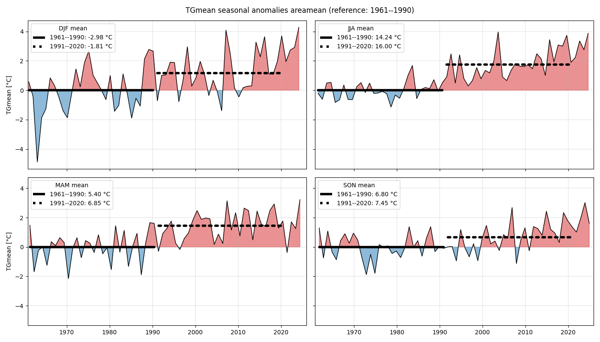

### Spatial plots for climatologies

Climatologies are plotted in two different ways. First, as a comparison plot, showing both climatologies (past: 1961—1990 and recent: 1991—2020) and the difference from recent - past. The plots for the seasonal comparison are generated for each season alone, as shown below.
The spatial plots are additionally generated as standalone plots for each field, as shown in the bottom plot for a summer climatology.

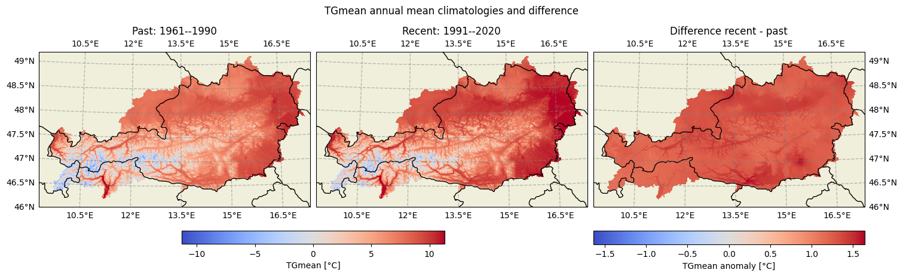

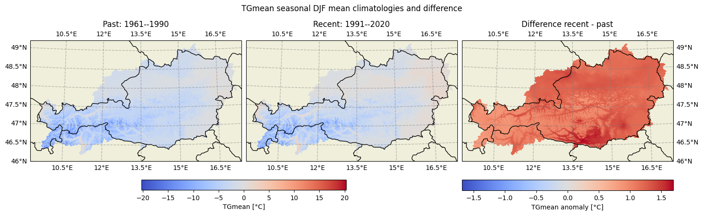

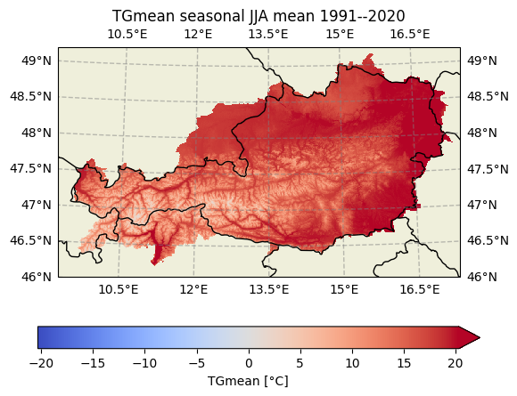

### Stampplots for yearly fields

In order to visualise annual/seasonal fields, each Year is plotted as field in the form of stampplots. The rows start at the beginning of a decade. There are two versions available, the absolute values of a quantity (top plot) and as anomalies with respect to the past period (1961—1990; bottom plot).

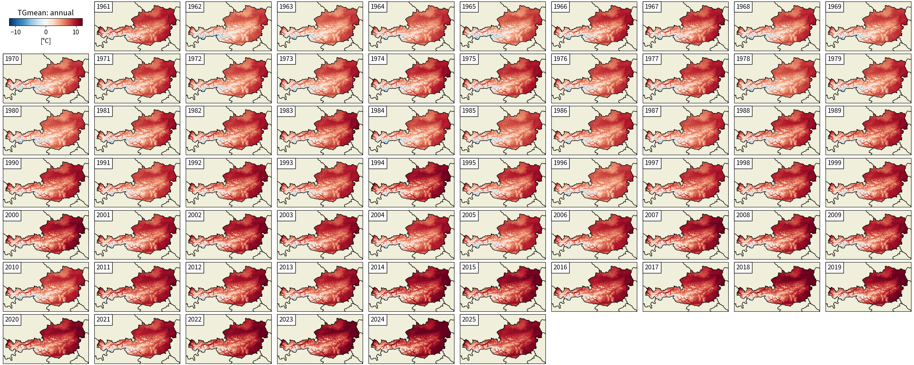

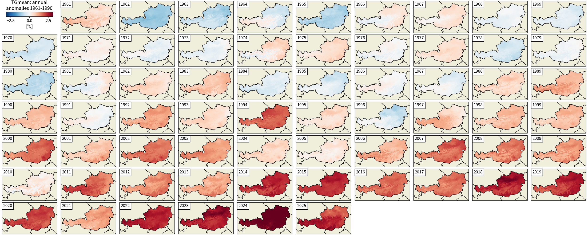

### Grouped significant changes plots

In order to give a quick overview across all indicators that have changed significantly (two-tailed Mann-Whitney test between recent and past with `p=0.05` as threshold), we group the climate indicators into categories and visualise the portion of the group with significant changes (i.e. $p_{value}<0.05$). `runoff` indicators are grouped with `snow`, `radiation` with `temperature` and the `mixed` group into either `precipitation`, `temperature`, or `humidity` depending on the indicator.

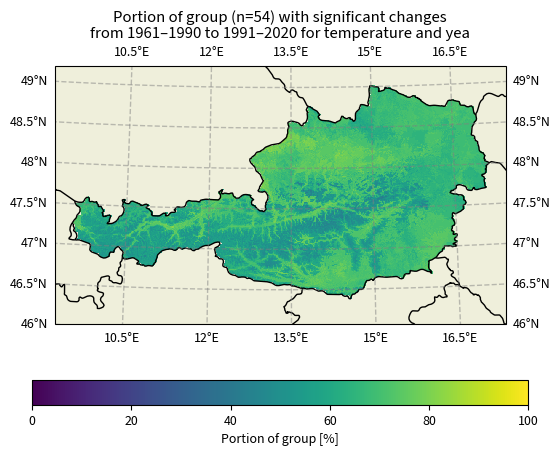

### Warming stripes

Warming stripes plots are generated in a similar amount as areamean timeseries plot, and show areameans for annual/seasonal anomalies for each year with respect to 1961—1990. The indicators are grouped into the main categories to provide a concise overview per group. `runoff` indicators are grouped with `snow`, `radiation` with `temperature` and the `mixed` group into either `precipitation`, `temperature`, or `humidity` depending on the indicator (similar to the grouped significant changes plot).

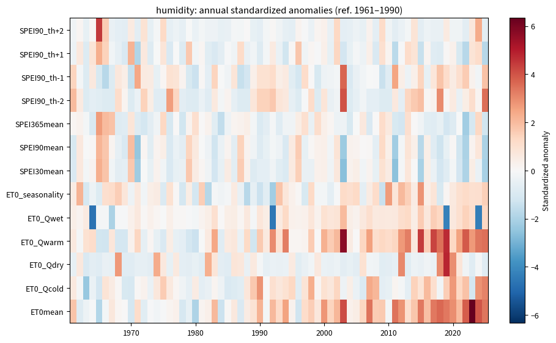

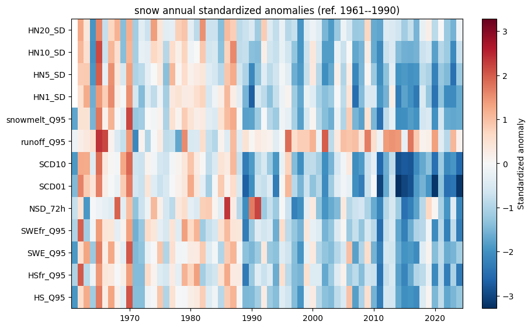

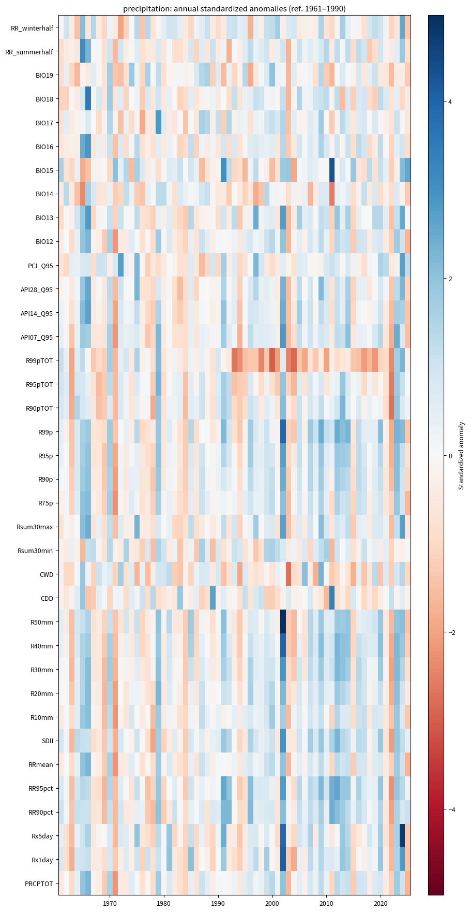

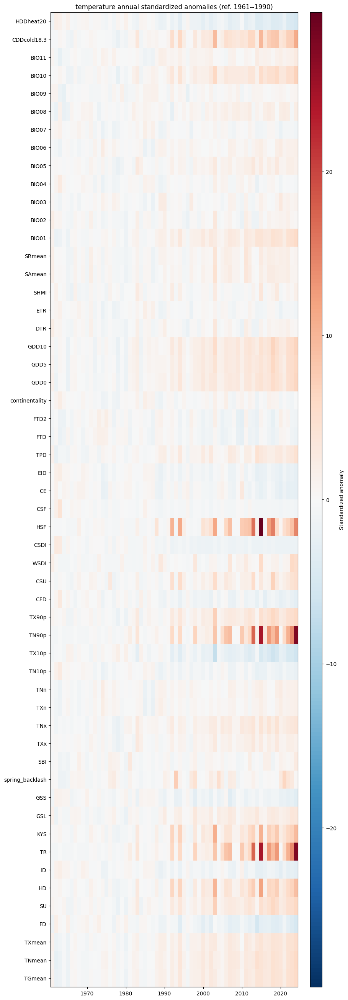
